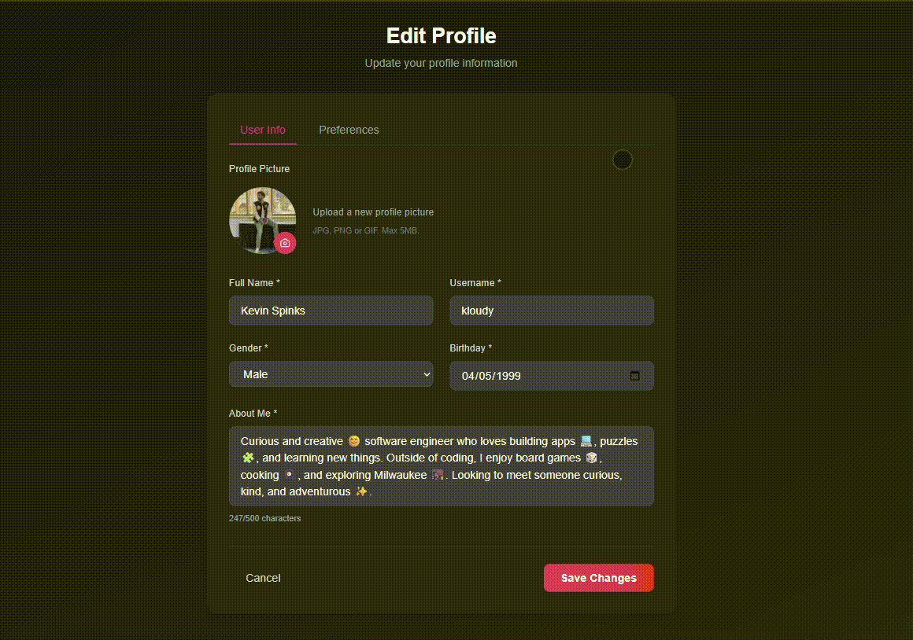
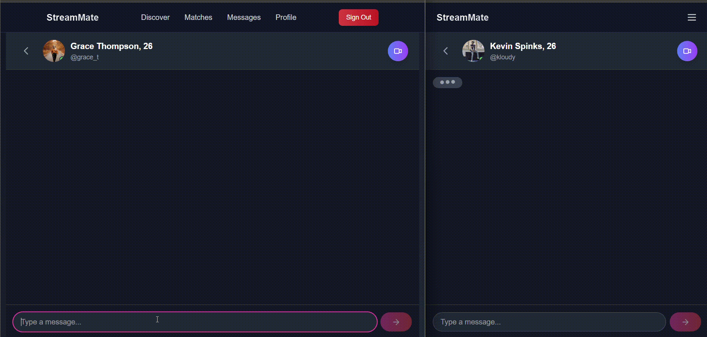

# StreamMate ❤️

A real-time, fullstack dating application where users can create profiles, swipe through matches, chat instantly, and build meaningful connections.

---

## Table of Contents

- [Live Demo](#live-demo)
- [Features](#features)
- [What I Learned](#what-i-learned)
- [Tech Stack](#tech-stack)
- [Screenshots / Media](#screenshots--media)
- [Environment Variables](#environment-variables)

---

## Live Demo

[View the deployed app here](https://dating-app-mu-mocha.vercel.app/)

---

## Features

- **User Registration & Login**: Secure authentication with NextAuth and OAuth support
- **Profile Setup & Editing**: Upload photos, add bio, interests, and customize profile
- **Swipe Interface**: Like / pass functionality to browse potential matches
- **Match Logic**: Mutual likes result in a match
- **Real-Time Messaging**: Chat instantly with matched users
- **Notifications / Alerts**: For likes, matches, and new messages
- **Explore / Discover Page**: Browse potential matches beyond immediate suggestions
- **Responsive UI**: Works seamlessly on desktop and mobile
- **Image Uploads & Media Support**: For profile pictures and chat media

---

## What I Learned

Building StreamMate strengthened my **full-stack and real-time application skills**. Key takeaways:

- ✅ Implementing **real-time messaging and notifications** with Stream and Supabase
- ✅ Managing **full authentication flow** with NextAuth and OAuth
- ✅ Building a **dynamic swipe interface** with state management and smooth transitions
- ✅ Handling **media uploads** and storage securely for profiles and chats
- ✅ Structuring **relational data models** for users, matches, messages, and media
- ✅ Optimizing **responsive layouts** with Tailwind CSS across multiple device sizes
- ✅ Deploying a **fullstack Next.js app** to Vercel with environment variable management

---

## Tech Stack

- **Frontend**: React, Next.js, Tailwind CSS, TypeScript
- **Backend / Database**: Supabase, PostgreSQL
- **Real-Time Messaging / Video Streaming**: Stream
- **Authentication**: NextAuth / OAuth
- **Hosting / Deployment**: Vercel

---

## Screenshots / Media

- **Landing / Home Page**
  

- **Profile Page**  
  

- **Swipe Deck / Matching Flow**  
  

- **Chat / Messaging Screen**  
  

---

## Environment Variables

Create a `.env.local` file in the root directory and add the following placeholders:

```env
# Supabase
NEXT_PUBLIC_SUPABASE_URL="YOUR_SUPABASE_URL"
NEXT_PUBLIC_SUPABASE_ANON_KEY="YOUR_SUPABASE_ANON_KEY"
SUPABASE_SERVICE_ROLE_KEY="YOUR_SERVICE_ROLE_KEY"


# Stream API
STREAM_API_SECRET="YOUR_STREAM_API_KEY"
PUBLIC_STREAM_API_KEY="YOUR_STREAM_API_KEY"

```
