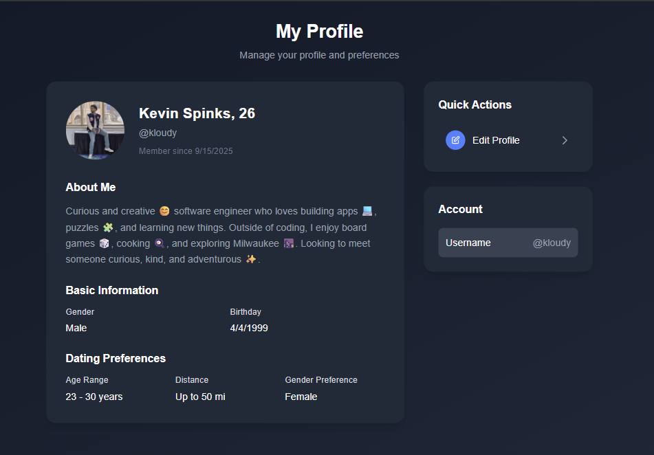

# StreamMate ❤️

A real-time, fullstack dating application where users can create profiles, swipe through matches, chat instantly, and build meaningful connections.

---

## Live Demo

[View the deployed app here](https://dating-app-mu-mocha.vercel.app/)

---

## Features

- User registration & login (with secure authentication)
- Profile setup & editing: upload photos, add bio, interests
- Swipe interface (like / pass) to browse potential matches
- Match logic: mutual likes result in a match
- Real-time messaging/chat between matched users
- Notifications / alerts for likes, matches, messages
- Explore / discover page for broader matching
- Responsive UI for desktop and mobile
- Image uploads & media support

---

## Tech Stack

- **Frontend**: React, Next.js, Tailwind CSS, TypeScript
- **Backend / Database**: Supabase, PostgreSQL
- **Hosting / Deployment**: Vercel
- **Real Time Messaging/Video Streaming**: Stream
- **Authentication**: Next Auth

---

## Screenshots / Media

> _(Add relevant screenshots or GIFs of UI in action)_

- **Landing / Home Page**
  

  - **Landing / Home Page**
    

- **Swipe Deck / Matching Flow**
  

- **Chat / Messaging Screen**
  

---
